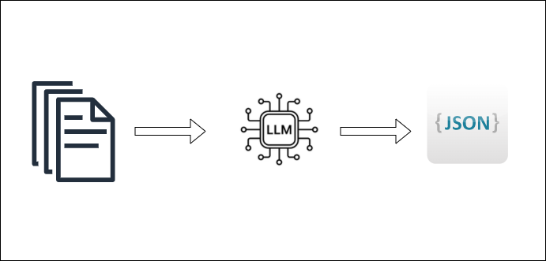

# Information Extraction from unstructured OCR-read textual data

## Content

1. [Short description](#short-description)
2. [Scripts](#scripts)
    - [Data Collection](#data-collection)
        - [Implementation](#implementation)
        - [Usage](#usage)
    - [LLMClient](#llmclient)
        - [Implementation](#implementation-1)
        - [config](#config)
        - [Application](#application)
    - [Data Annotation](#data-annotation)
        - [Implementation](#implementation-2)
        - [Application](#application-1)
3. [Labelling/Verfication](#labellingverfication)
    
4. [Venv](#virtual-environment)

## Short description

The overall concept here could be located in the area of Named-Entity-Recognition. We try to extract predefined information from a set of unstructured documents.




## Scripts

### Data Collection

Data Collection implements the class `DataCollector`. The classes purpose is it to gather data from the API of deutsche Zeitungsportal, which provides access to a huge collection of ocr-read historical german newspapers. With the api it is possible to pull whole (ocr-read) newspaper pages that match a certain query, e.g. in this Implementation "Heiratsgesuch" (eng. "marriage proposal") in a tabular format.

#### Implementation

- `__init__`
    - `places:list[str]` - List of strings that specifies from which places the retrieved newspaper articles should come from. If places is left None places will be set to a default list, which tries to cover all possible places.
    - `write_output:bool` - Boolean values that specifies if an output csv File should be written
    - `output_path:str` - Path that specifies where that data should be saved
    - `query:str` - Search term that we are looking for
    - `retrieved_data:pd.DataFrame` - placeholder for the retrieved data
- `save_data` - saves `retrieved_data` if `write_output` is True and `output_path` is set
- `get_data_from_query` - calls the API and retrieves that data. Because there is a certrain rate limit set in the API on how long the data transmission process can be we have to perform multiple calls here and loop over the given values in `places` and `query`. The results will then be saved into a list and concatonated before storing it in `retrieved_data`. 
- `create_random_sample` - creates a random sample of 100 examples and returns the sample as pd.DataFrame.

#### Usage

```python
from src.DataCollection import DataCollector

collector = DataCollector(
    places=None,
    write_output=True,
    output_path="dataset.csv", 
    query=["example_query"]
)
collector.get_data_from_query()

```


### LLMClient

`LLMClient` implements the class `LLMWorker`. `LLMWorker` uses the gemini api to perform the information extraction part. But it could potentially also be used for other task. It receives two lists - one that contains ids the will be used to map an input to a output value and an other one that contains the textual data.

#### Implementation

- `__init__`
    - `config:dict` - contains the configurations used to create model, aswell as the key used for the model
    - `initialised_model:bool` - boolean placeholder that indicates if the model has been initialised, default False
    - `input_id:list[str]` - List that contains the input ids 
    - `text:list[str]` - List that contains the texts the model should process.
    - `model` - placeholder for the model. Will be loaded and initialised with the parameters stored in config
    - `output:dict[str, list[str]]` - placeholder for the output that will be returned after all texts has been processed
    - `prompt_key:` - key that is used in the config for the prompt
- `set_config` - sets the API-Key 
- `load_model` - initialises the model and stores it in `model`
- `create_model_input` - creates the model input that will be send to the gemini api. Essentially it concatonates the prompt and the input text that will be processed in the current iteration
- `extract_single_page` - sends a the model input to the gemini api and receives and reads the response into a dictionary. 
- `extract_content` - iterates over all the `input` and `text` list and processes each value. Returns the dict with the extracted information

#### config

The config essentially needs four keys: "API_KEY", "PROMPT", "model_name", "generation_config". 

- `API_KEY` - in the example the API Key is loaded from an environment variable. But it could also be hardcoded (wouldn't recommend). 
- `PROMPT` - Prompt/Instructions you want to give the model
- `model_name` - Specific model name from the gemini/google family, see their documentation on model names 
- `generation_config` - Model specifications and hyperparmaters for the text generation. Would recommend to try out changing temperature, top_k, top_p. What also needs to be set is the response_mime_type - in this case here "application/json". This indicates that the model should response in a predefined (json) response scheme, that can be manually defined. This scheme can defined in pydantic schemes. This way we can easily parse the reponses as json-Strings, which makes the work for us easier.


```python

import os
from src.schemes import ExtractedContent
configs = {
  "API_KEY" : os.environ.get("GEMINI_API_KEY"),
 
  
  "PROMPT":"Your Prompt here",
  
  "model_name":"gemini-2.5-flash",
  
  "generation_config" : {
    "temperature": 1,
    "top_p": 0.95,
    "top_k": 40,
    "max_output_tokens": 65536,
    "response_mime_type": "application/json",
    "response_schema": ExtractedContent,
    }
}

```

#### Application

```python
import pandas as pd

random_sample = pd.read_csv("example.csv")
extract = LLMWorker(configs=configs, input_id=random_sample.page_id.tolist(), text=random_sample.fulltext.tolist())
extracted_content = extract.extract_content()

```

exctracted_content will then look like this:

```json

{
    "results": {
        "HUTO4BYZPVG3ZIFH5Q3RTJKHQSP36DLN-ALTO16820921_DDB_FULLTEXT": [
            "Heiratsgeſuch, Gulsbeſitzer, 26 Jahre, ebv. , wünſcht die Bekanntſchaft einer jungen Dame mit etwas Ver - mögen zwecks ſofortiger Heirat . Diskretion Ehrenſache . Offerten unter V. 0389 an die Exped .",
            "Witwe, 30 Jahre, ſehr däuslich, wiſcht Bekanntſchaft mit Jolidem Herrn zwecks baldiger Verheiralung, r gen einem e ausgeſchloſſen . Nur ernſtgeme Offerten unter V. 0765 an die Expedition ."
        ],
        "PSUHB3HUAXFDXK5VTZQ6BG5ASB5INL3V-ALTO16457896_DDB_FULLTEXT": [
            "gleiner Landwirt , Mitte 30 , ſtrebſ . , wſcht . Be - kanntſchaft mit Mädchen v . Lande . auch dienend . Stand . im Alter von 25 - 30 J . zw . Heirat . Off . mit Angabe d . Verhältn . auch Bild beförd . die Fil . d . Bl . Leipzigerſtr . 34 u . t 7531 an die Exp . d . Bl . So —",
            "Junger Mann 29 J . gut . Eharakt . , 30 o Verm . in Mineralw . - Branche tätig , ſucht Bekanſchft . mit einf . , fleiß . Mädchen dienend . Standes m . etw . Erſparniſſen zw . Heirat . Off . mögl . mit W unt . B . 2522 an die Exp . - \r e -",
            "Jg . Herr , in guten Verh, , kann WMijähr . , häusl . u . geb . Fräulein mit 120000 M . ſpät . Vermög . heiraten . Ausführl . Offert . erbet . u . F . 2626 a . d . Exp . d . Bl . Keine gewerbsm . Vermittl .",
            "Köchin , 30 J . ſucht zw . Heikat Bek . mit ſolid . Mann in ſich . Stell . Witwer mit Kind nicht aus⸗ geſchloſſ . Off . w . mögl . m . Bild , unt . C . 2643 a . d . Exp . d . Bl .",
        ]
    }
}

```


### Data Annotation

`DataAnnotation` implements the class `DataAnnotator`. This class annotates the information extraction results retrieved from `LLMWorker` in the manner of named entity recognition. This means DataAnnotator identifies the positions/string indeces of the extracted content in the original fulltext string. This is done so we can load the annotated dataset into a labelling application to verify the results of our inference and catch potential non labelled examples the LLM didn't find. Like this we can also quantify the quality of our information extraction. 


#### Implementation

- `__init__`
    - `extracted_content_dict:dict` - dictionary retrieved from LLMWorker
    - `full_text_dict:dict` - dictionary that contains the the page_ids as keys and the corresponding original fulltexts as theier values
    - `threshold:float` - threshold that needs to be meet regarding a fuzzy stringsimiliarity
- `get_annotation_position` - return the start and end position of the extracted string inside of the original fulltext and a label
- `get_fuzzy_annotation_position` - the extracted text runs over the fulltext like a sliding window. For every iteration of the window the levenstein distance is calculated. The match with the similiarity will be returned as best match and so the position of this match (if the threshold is met). 
- `get_position` - executes  get_annotation_position and get_fuzzy_annotation_position and returns the positions of the extracted text or None
- `make_entry` - creates an initial dictionary entry for the fulltext together with the page_id
- `add_annotations` - adds the annotations to the initial entry created with `make_entry`
- `annotate_data` - uses `extracted_content_dict` and `full_text_dict` and creates a labelled dataset, that can be loaded into label-studio

#### Application

```python 
from src.DataAnnotation import DataAnnotator

annotaed_dict = DataAnnotator(fulltext_dict=fulltext_dict, extracted_content_dict=extracted_content["results"]).annotate_data()


```

## Labelling/Verfication

Install Label-Studio via pip and start it. Then import the output of `DataAnnoator` and select Named Entity Recognition as your Task and look into the data and start annotating (verifying the labels and adding not recognised content as new labels).

```bash
pip install label-studio
label-studio start
```

## Virtual Environment

Create your virtual environment for this application with create_venv.sh

```
sh create_venv.sh
```